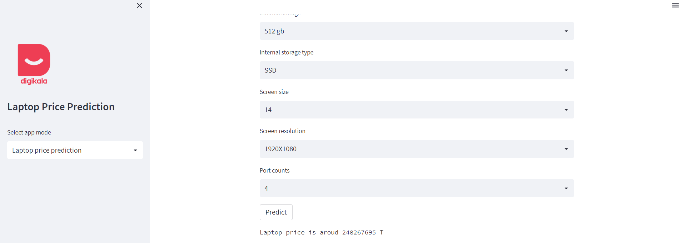
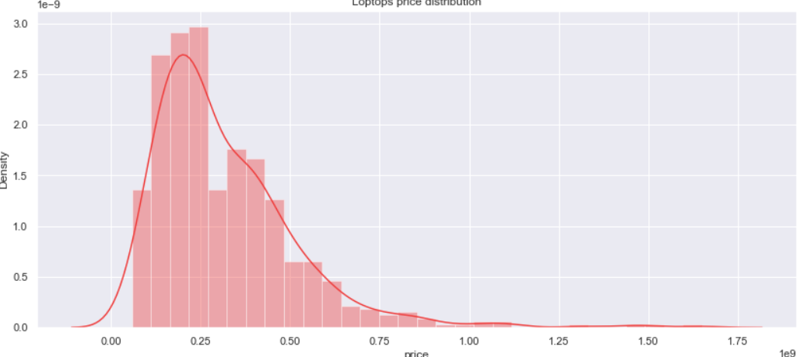
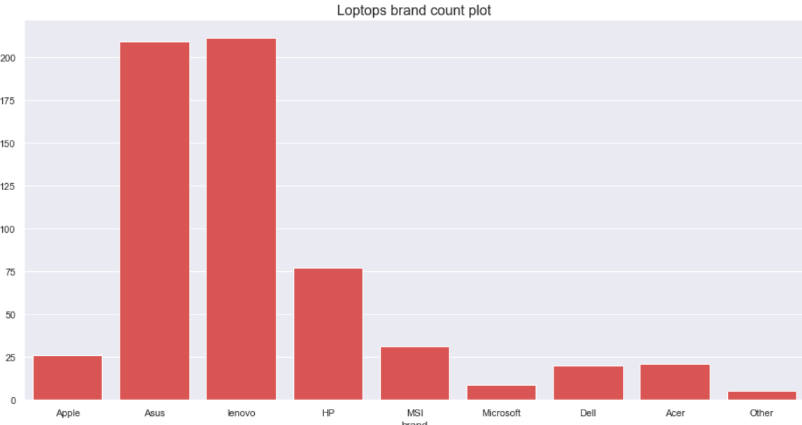
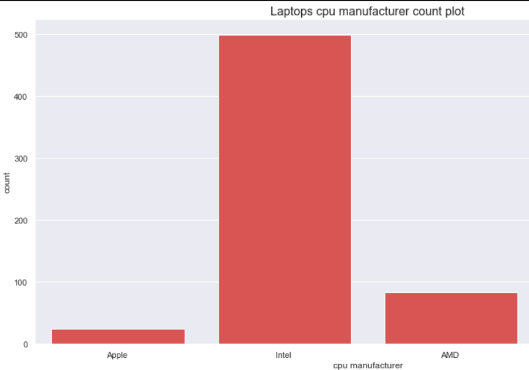
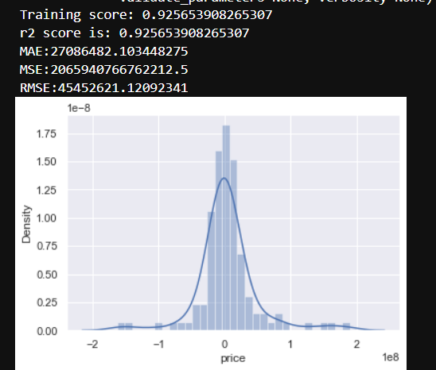
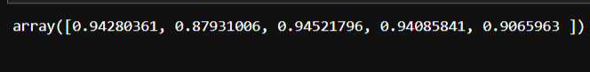
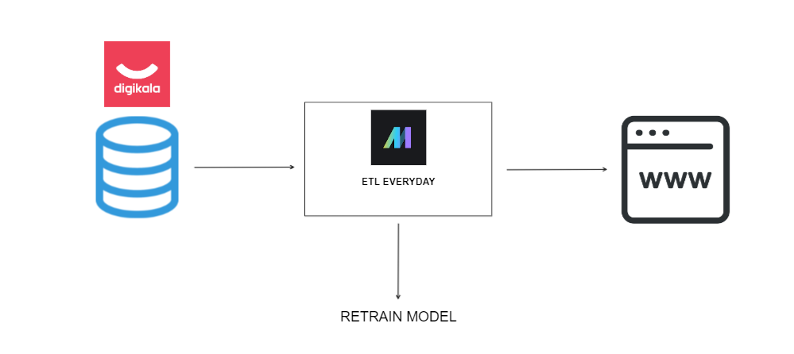

# Loptop-price-prediction-end-to-end-project-using-ecommerce-website-data
In this project, I tried to create a model that can predict the price of a laptop based on the criteria of the desired laptop by using the data of the available laptops that I collected from the Digikala website, the largest e-commerce site in Iran.

***Note: Since the price of laptops in Iran is constantly changing, I used Mage for this project, a modern tool for build and orchestrate data pipelines that fetch and prepare data and retrain model based on newset data.***

### Watch Demo here  : 
https://meysamraz-laptop-price-prediction-project.streamlit.app/

### Watch Demo here ***heroku version*** : 
##### update : heroku may shutdown free hosting at 2022 - 28 nov so if this link didnt work use link above 

https://loptop-price-prediction.herokuapp.com/

***Predict price is in Rial (Iran's currency)***

# Project Overview : 

## 1 - Collect Data 
To collect my data, I used Digikala's secret api. I was able to collect the data I wanted (available laptops with prices) with a simple fitler.
- #### Collect Laptop main data 
    -   id : ID registered for laptop in Digikala
    -   title_fa : The name of the laptop in Farsi
    -   title_en : The name of the laptop in English
    -   price : Laptop price in Rial (Iranian currency)
    -   image_url : Laptop photo
    -   brand : Laptop brand

- #### Collect Laptop details data
    -   cpu manufacturer : Laptop cpu manufacturer
    -   cpu series : The cpu series used in the laptop
    -   cpu model : The cpu model used in the laptop
    -   ram : Laptop RAM capacity
    -   ram type : The type of RAM used in the laptop
    -   internal storage : Internal storage capacity of the laptop  
    -   internal storage type : The type of internal storage in loptop
    -   gpu manufacturer : Laptop gpu manufacturer
    -   gpu model : The gpu model used in the laptop
    -   screen resolution : Laptop screen resolution
    -   ports : Ports used in laptops

- #### Merge Collected data
- #### Remove duplicated rows 
- #### Save data into csv file 

## 2 - Take a look at data :
After collecting the data, I started checking the collected data to make sure it was collected correctly
- #### Check shape of data 
- #### Check is there any null value
- #### Check data types
- #### Check number of unique values in each column

## 3 - Cleaning data 
Like all machine learning projects, the data doesn't arrive perfect and ready for prediction. At this point, I started cleaning the collected data.
- #### Convert brands name from persian to english
- #### Convert ram from persian to english digits
- #### Clean and convert internal storage to english
- #### Convert and clean internal storage to english
- #### Convert and clean laptops screen size
- #### Clean laptops resolution

## 4 - EDA 
For the next step, which is **Feature engineering**, it was necessary to get information about the data. In this step, I analyzed and explored the data.
  
- #### Laptops price distribution
- #### Number of laptops of each brand
- #### Number of cpu of each cpu manufacturer
- #### Number of laptops for each ram group 
- #### Number of laptops for each ram type group
- #### Number of laptops with diffrent internal storage
- #### Number of laptops for each internal storage group
- #### Number of laptops with diffrent screen sizes
- #### Number of laptop with diffrent screen resolution

## 5 - Feature Engineering
In this step, I prepared the features for training the model
- #### Remove outliers base on laptops price using z score
- #### Convert screen resolution to number
- #### Extract Gaming brands from title (asus rog , acer nitro ...)
- #### Remove brand with only one laptop
- #### Extract clean gpu model from gpu model column
- #### Remove laptops with only less than 3 model gpu
- #### Label endcoding cleand gpu models
- #### Convert internal storage from tb and gb to mg
- #### Label encoding internal storage type
- #### Convert ram from str to int
- #### Extract port count
- #### Label encoding ram type
- #### Label encoding cpu series
- #### One hot encoding brand - cpu manufacturer - gpu manufacturer (nominal categorical variables)

## 6 - Feature Selection
In this step, I chose the features needed to train the model
- #### Check correlation
- #### Mutual information regression

## 7 - Model training  
 

## 8 - Hyperparameter tuning

## 9 - Cross validation

## 10 - Save model
I pickeld model for use in the gui environment

## 10 - Create Data Pipline
I used mage-ai (moderen and easier version of Airflow), to ETL data from Digikala everyday and retrain model based on newest data and export model 

 

## 11 - Website
To create website, I used streamlit formwork, a powerful formwork that allows me to create the desired user interface completely using Python.

## 12 - Deploy
I used [Heroku](https://www.heroku.com/) a cloud platform as a service which provide a free hosting to deploy my app on it. it's and amzaing platform gave me so much flexbilte to deploy your apps 

##  Libraries and FrameWorks used in the project

- [streamlit](https://streamlit.io/)
- [pandas](https://pandas.pydata.org/)
- [numpy](https://numpy.org/)
- [matplotlib](https://matplotlib.org/)
- [seaborn](https://seaborn.pydata.org/)
- [termcolor](https://pypi.org/project/termcolor/)
- [scikit-learn](https://scikit-learn.org/)
- [scipy](https://scipy.org/)
- [xgboost](https://xgboost.readthedocs.io/)
- [mage-ai](https://www.mage.ai/)
